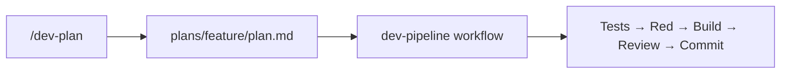

# Agentic Dev Claude Workflow

A sandbox for testing **agentic development** with Claude Code: an interactive planning step produces a spec, then a headless TDD pipeline implements it without follow-up questions.

The sample app (a small FastAPI server) exists mainly as a target for that workflow — not as the product itself.

## How it works



1. **Plan** — Run `/dev-plan` with a feature description. Claude explores the codebase, asks clarifying questions, and writes a spec to `plans/<feature-name>/plan.md`.
2. **Build** — Run the `dev-pipeline` workflow against that spec. A headless agent writes tests first, confirms they fail (TDD red), implements until green, reviews, and commits if quality gates pass.

## Core files

| File | Role |
|------|------|
| [`.claude/commands/dev-plan.md`](.claude/commands/dev-plan.md) | Slash command: interactive planning → `plans/<feature>/plan.md` |
| [`.claude/workflows/dev-pipeline.js`](.claude/workflows/dev-pipeline.js) | Workflow: TDD pipeline driven by the plan |

### `/dev-plan`

The planning command:

- Reads the existing codebase (stack, patterns, tests) before asking questions
- Asks only what cannot be inferred from the repo
- Writes a spec with required sections the pipeline depends on: **Goal**, **User-visible behaviour**, **Test contracts**, **Out of scope**
- Hands off with the workflow invocation

Example:

```
/dev-plan Add a POST /geocode endpoint that returns lat/lon for an address
```

Output: `plans/address-geocode-endpoint/plan.md` (see [example plan](plans/address-geocode-endpoint/plan.md)).

### `dev-pipeline`

The build workflow runs five phases:

| Phase | What happens |
|-------|----------------|
| **Write tests** | Full test suite from the plan’s Test contracts—no implementation yet |
| **Red check** | Run tests; they should fail (correct TDD red state) |
| **Build** | Implement from the spec; iterate up to 5 rounds until tests pass |
| **Review** | Adversarial review vs spec (confidence 0–10) |
| **Commit** | Commit if tests pass and review confidence ≥ 7 |

Kick off after planning:

```
/dev-pipeline plans/<feature-name>/plan.md
```

Or pass a folder name (resolves to `plans/<name>/plan.md`)

**Contract:** Tests written in phase 1 are the source of truth. The build agent must not modify them.

## Repository layout

```
.
├── .claude/
│   ├── commands/dev-plan.md      # Planning slash command
│   └── workflows/dev-pipeline.js # TDD build workflow
├── plans/                        # Feature specs (one folder per feature)
├── src/
│   └── app/                      # Sample FastAPI app (workflow output)
│       ├── main.py               # Routes and API models
│       └── geocoding.py          # Nominatim geocoding logic
├── tests/
└── workflow-app/                 # UI to inspect pipeline runs (optional)
```

## Sample application

The current codebase is a minimal **FastAPI** app used to exercise the pipeline:

- `GET /health` — health check
- `POST /geocode` — geocode an address via geopy/Nominatim (tests mock the geocoder)

### Run locally

```bash
# Install dependencies (requires uv or pip)
uv sync
# or: pip install -e ".[dev]"

# Run tests
pytest

# Start the server
uvicorn app.main:app --reload
```

## Workflow viewer (optional)

[`workflow-app/`](workflow-app/) is a small React + Express app that watches Claude agent transcripts and visualizes `dev-pipeline` runs (phases, logs, agent panels).

```bash
cd workflow-app
npm install
npm run dev
```

Open the URL printed in the terminal (default port `5174`).

## Adding a new feature

1. `/dev-plan <describe the feature>`
2. Review or edit `plans/<feature>/plan.md`
3. `/dev-pipeline plans/<feature>/plan.md`
4. Inspect results in git history and/or the workflow viewer

## Design principles

- **Spec before code** — Behaviour and test contracts are fixed in the plan; the build agent does not reinterpret requirements mid-flight.
- **TDD by default** — Red → green; tests are written before implementation.
- **Headless build** — The pipeline is designed so a single agent run can complete a feature without interactive clarification.
- **Thin sample app** — Keep the application simple so experiments focus on planning and pipeline quality, not domain complexity.
