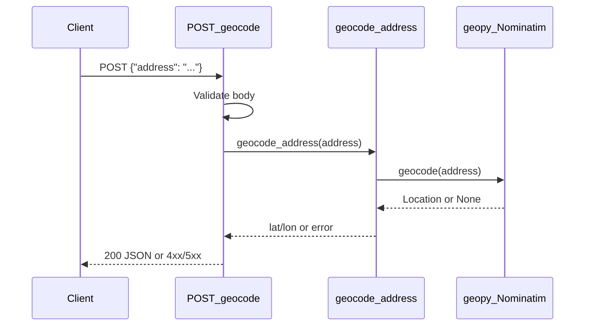

# Address Geocode Endpoint

## Goal

Extend the existing FastAPI server ([main.py](main.py)) with a `POST /geocode` endpoint that accepts a free-text address and returns its latitude and longitude. Geocoding is performed via **geopy** using the **Nominatim** (OpenStreetMap) backend — free, no API key, outbound HTTP at runtime only. Tests mock the geocoder so the TDD pipeline never depends on live Nominatim availability.

## Current codebase snapshot

- Flat layout: [main.py](main.py) holds the FastAPI app; [tests/test_health.py](tests/test_health.py) uses `TestClient` + pytest.
- Dependencies in [pyproject.toml](pyproject.toml): `fastapi`, `uvicorn`; dev: `pytest`, `httpx`.
- Existing `/health` endpoint is unchanged; this feature adds a sibling route.

## Architecture




| Decision             | Choice                                           | Reason                                                |
| -------------------- | ------------------------------------------------ | ----------------------------------------------------- |
| Library              | `geopy` + `Nominatim`                            | User-selected; standard Python geocoding wrapper      |
| HTTP method          | `POST /geocode`                                  | User-selected; JSON body for multi-word addresses     |
| Test strategy        | Mock `geocode_address` wrapper                   | Avoid flaky network calls; TDD pipeline stays offline |
| Layout               | New [geocoding.py](geocoding.py) at project root | Keeps `main.py` thin; single mock target for tests    |
| Nominatim User-Agent | Required string in geocoder init                 | Nominatim ToS compliance                              |


### Files to add/modify

- [pyproject.toml](pyproject.toml) — add `geopy>=2.4.0` to `dependencies`; add `geocoding.py` to hatch wheel `include`
- [geocoding.py](geocoding.py) — `geocode_address(address: str) -> tuple[float, float]` wrapping Nominatim; raises domain exceptions for not-found and service errors
- [main.py](main.py) — Pydantic request/response models, `POST /geocode` route, input validation (empty/whitespace), HTTP status mapping
- [tests/test_geocode.py](tests/test_geocode.py) — full contract coverage with `unittest.mock.patch` on `geocoding.geocode_address`

### Request / response shapes

```json
// POST /geocode — request
{ "address": "1600 Amphitheatre Parkway, Mountain View, CA" }

// POST /geocode — 200 OK
{ "latitude": 37.422, "longitude": -122.084 }

// POST /geocode — 422 (missing field)
{ "detail": [ { "type": "missing", "loc": ["body", "address"], ... } ] }

// POST /geocode — 400 (empty or whitespace-only address)
{ "detail": "Address must not be empty" }

// POST /geocode — 404 (geocoder returned no result)
{ "detail": "Address not found" }

// POST /geocode — 503 (geocoder timeout or service error)
{ "detail": "Geocoding service unavailable" }
```

## User-visible behaviour

### Happy path

- `POST /geocode` with JSON body `{"address": "<non-empty string>"}` returns HTTP **200** with JSON body `{"latitude": <float>, "longitude": <float>}`.
- `latitude` and `longitude` are the coordinates returned by the geocoder for the given address (WGS-84 decimal degrees).

### Failure modes

- **Missing `address` field** (body `{}` or field omitted): HTTP **422** with FastAPI/Pydantic validation error body.
- **Empty string** (`{"address": ""}`): HTTP **400**, body `{"detail": "Address must not be empty"}`.
- **Whitespace-only** (`{"address": "   "}`): HTTP **400**, body `{"detail": "Address must not be empty"}`.
- **Address not found** (geocoder returns no result): HTTP **404**, body `{"detail": "Address not found"}`.
- **Geocoder service failure** (timeout, network error, or geopy `GeocoderServiceError` / `GeocoderTimedOut`): HTTP **503**, body `{"detail": "Geocoding service unavailable"}`.
- **Wrong HTTP method** (`GET /geocode`): HTTP **405**, FastAPI default `{"detail": "Method Not Allowed"}`.

### Unchanged behaviour

- `GET /health` and all existing health tests continue to pass unchanged.

## Test contracts

### TDD approach

This feature follows **test-driven development**:

1. **Red** — write tests in [tests/test_geocode.py](tests/test_geocode.py) from the contracts below; patch `geocoding.geocode_address`; tests must fail (no route / no implementation).
2. **Green** — implement [geocoding.py](geocoding.py), route in [main.py](main.py), and dependency until all tests pass.
3. Tests are the contract — do not weaken or delete tests to make implementation easier.

All geocode tests **patch** `geocoding.geocode_address` (never call live Nominatim).

### `POST /geocode` — happy path

- **Endpoint:** `POST /geocode`
- **Setup:** `geocode_address` mock returns `(37.422, -122.084)`
- **Input:** `{"address": "1600 Amphitheatre Parkway, Mountain View, CA"}`
- **Expected:** `200`, body `{"latitude": 37.422, "longitude": -122.084}`
- **Assert:** mock called once with the exact address string from the request

### `POST /geocode` — missing address field

- **Input:** `{}`
- **Expected:** `422`

### `POST /geocode` — empty address

- **Input:** `{"address": ""}`
- **Expected:** `400`, body `{"detail": "Address must not be empty"}`
- **Assert:** `geocode_address` not called

### `POST /geocode` — whitespace-only address

- **Input:** `{"address": "   "}`
- **Expected:** `400`, body `{"detail": "Address must not be empty"}`
- **Assert:** `geocode_address` not called

### `POST /geocode` — address not found

- **Setup:** mock raises `AddressNotFoundError` (domain exception defined in `geocoding.py`)
- **Input:** `{"address": "xyznonexistentplace12345"}`
- **Expected:** `404`, body `{"detail": "Address not found"}`

### `POST /geocode` — geocoder unavailable

- **Setup:** mock raises `GeocodingServiceError` (domain exception defined in `geocoding.py`)
- **Input:** `{"address": "Some Address"}`
- **Expected:** `503`, body `{"detail": "Geocoding service unavailable"}`

### `GET /geocode` — method not allowed

- **Input:** `GET /geocode`
- **Expected:** `405`, body `{"detail": "Method Not Allowed"}`

## Out of scope

- API keys or authentication
- Rate limiting, caching, or request deduplication
- Reverse geocoding (coordinates → address)
- Batch / multi-address geocoding
- GET variant of the endpoint
- Custom Nominatim server URL configuration (use geopy default)
- Structured address fields (street, city, zip as separate inputs)

## Todos

- Write failing tests in `tests/test_geocode.py` from Test contracts (mock `geocode_address`)
- Add `geopy` dependency and `geocoding.py` with Nominatim wrapper + domain exceptions
- Implement `POST /geocode` route and Pydantic models in `main.py`
- Verify all tests pass (existing health + new geocode)

