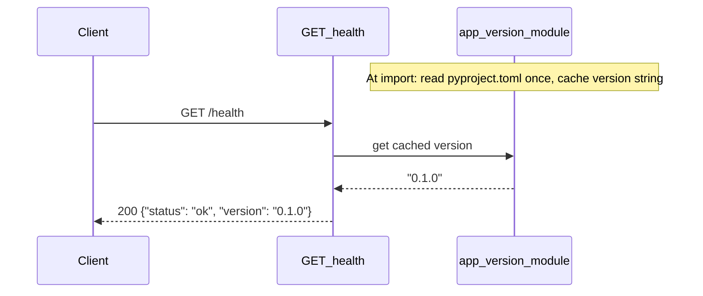

# Health Version Endpoint

## Goal

Extend the existing `GET /health` endpoint so operators and load balancers can confirm the server is running **and** identify which application version is deployed. Version is sourced from `[project].version` in the repo-root `pyproject.toml` (currently `0.1.0`), keeping a single source of truth for releases without adding a separate `package.json`.

## Current codebase snapshot

- FastAPI app in [`src/app/main.py`](../../src/app/main.py) with `GET /health` returning `{"status": "ok"}` only.
- Version defined in [`pyproject.toml`](../../pyproject.toml) under `[project].version`.
- Tests in [`tests/test_health.py`](../../tests/test_health.py) assert exact body `{"status": "ok"}` — these must be updated as part of this feature.
- Test setup: pytest with `pythonpath = ["src"]`, `TestClient` from FastAPI.

## Architecture



| Decision | Choice | Reason |
|---|---|---|
| Route | Extend existing `GET /health` | User-selected; one probe for liveness + version |
| Version source | `pyproject.toml` `[project].version` | User-selected; matches Python packaging for this repo |
| Load timing | Once at module import (cached) | Avoid disk I/O on every health check |
| Parser | `tomllib` (stdlib ≥3.11) | No new dependencies; project requires Python ≥3.11 |
| Path resolution | Walk up from `__file__` to repo root | Works in dev (`pytest`) and when cwd varies |

### Recommended module layout

- [`src/app/version.py`](../../src/app/version.py) — `APP_VERSION: str` loaded at import from repo-root `pyproject.toml`
- [`src/app/main.py`](../../src/app/main.py) — import `APP_VERSION`; `health()` returns `{"status": "ok", "version": APP_VERSION}`

### Response shape

```json
// GET /health — 200 OK
{ "status": "ok", "version": "0.1.0" }
```

Field order in JSON is not guaranteed; tests must compare parsed dicts, not raw strings.

## User-visible behaviour

### Happy path

- `GET /health` returns HTTP **200** with JSON body:
  ```json
  { "status": "ok", "version": "<value of [project].version in repo-root pyproject.toml>" }
  ```
- `Content-Type` includes `application/json`.
- The `version` string equals the semver (or other string) in `pyproject.toml` — currently `"0.1.0"`.
- `POST /health` continues to return HTTP **405** with FastAPI default body `{"detail": "Method Not Allowed"}`.

### Failure modes

- **Undefined routes:** Unchanged — `GET /nonexistent` → **404**, `{"detail": "Not Found"}`.

No authentication or rate limiting on `/health`.

## Test contracts

### TDD approach

This feature follows **test-driven development**:

1. **Red** — update/add tests in `tests/test_health.py` from the contracts below; they must fail until implementation adds the `version` field and version loader.
2. **Green** — implement `version.py` and extend `health()` only enough to satisfy tests.
3. Tests are the contract — implementation must not weaken or rewrite them to pass.

### Helper for tests

Tests should not hardcode `"0.1.0"` in a way that breaks when version is bumped. Use a test helper that reads expected version from repo-root `pyproject.toml` via `tomllib` (same source as production code).

### `GET /health` — extended response

- **Endpoint:** `GET /health`
- **Handler:** `health()` in `src/app/main.py`
- **Happy path:**
  - Input: `GET /health`
  - Expected: `200 OK`
  - Body: `{"status": "ok", "version": <expected_version_from_pyproject>}`
  - Where `<expected_version_from_pyproject>` is `[project].version` read from `pyproject.toml` at test time
- **Content-Type:** response headers include `application/json`

### `POST /health` — method not allowed (unchanged)

- **Endpoint:** `POST /health`
- **Happy path (for this verb):** N/A
- **Failure input:** `POST /health` with empty body
- **Expected:** `405 Method Not Allowed`, body `{"detail": "Method Not Allowed"}`, `Content-Type` includes `application/json`

### Undefined route (unchanged)

- **Input:** `GET /nonexistent`
- **Expected:** `404`, body `{"detail": "Not Found"}`

## Out of scope

- Adding or maintaining a root `package.json`
- Separate `/version` or `/info` endpoints
- Git commit hash, build timestamp, or environment name in the response
- Deep dependency health checks (database, Nominatim, disk space)
- Hot-reloading version without process restart when `pyproject.toml` changes
- Changing geocode/distance endpoints or their tests
- OpenAPI schema customization beyond what FastAPI infers from the return dict
- Startup fail-fast or import-time errors when `pyproject.toml` is missing or malformed
